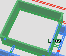

# View mode: Indoor

<table>
  <tr>
    <td>What</td><td>tags</td><td>geometry type</td><td>rendering</td><td>screenshot</td><td>progress</td>
  </tr>
  <tr>
    <td>Room</td><td>indoor=room</td><td>Buffered Linestring (2x10cm)</td><td>footprint extrusion</td><td></td><td>dev</td>
  </tr>
  <tr>
    <td>Wall</td><td>indoor=wall</td><td>Buffered Linestring (2x10cm)</td><td>footprint extrusion #f0f0f0</td><td></td><td>dev</td>
  </tr>
  <tr>
    <td>Indoor area Corridor</td><td>indoor=area indoor=corridor</td><td>Polygon</td><td>flat area #fafafa</td><td></td><td>dev</td>
  </tr>
  <tr>
    <td>Door</td><td>indoor=door door=*</td><td>Point</td><td>door icon</td><td></td><td>dev</td>
  </tr>
  <tr>
    <td>Door</td><td>indoor=door door=*</td><td>Polygon (width=90cm)</td><td>part of the whole</td><td></td><td>dev</td>
  </tr>
  <tr>
    <td>Footway</td><td>highway=footway</td><td>LineString</td><td>flat dotted line #f8fabf</td><td></td><td>dev</td>
  </tr>

  <tr>
    <td>Stairs</td><td>room=stairs stairs=*</td><td>Point</td><td>- stairs icon - specific color </td><td></td><td>todo</td>
  </tr>
  <tr>
    <td>Elevator</td><td>elevator=*</td><td>Point</td><td>- elevator icon - specific color </td><td></td><td>todo</td>
  </tr>
  <tr>
    <td>Toilets</td><td>toilets=* room=toilets</td><td>Point</td><td>- toilets icon - specific color </td><td></td><td>todo</td>
  </tr>
  <tr>
    <td>Shop</td><td>room=shop</td><td>Point</td><td>- shop icon - specific color </td><td></td><td>todo</td>
  </tr>
  <tr>
    <td>Office</td><td>room=office</td><td>Point</td><td>- office icon - specific color </td><td></td><td>todo</td>
  </tr>
  <tr>
    <td>Classroom</td><td>room=class</td><td>Point</td><td>- class icon - specific color </td><td></td><td>todo</td>
  </tr>
  <tr>
    <td>Restaurant</td><td>room=restaurant</td><td>Point</td><td>- restaurant icon - specific color </td><td></td><td>todo</td>
  </tr>
</table>

# Building

<table>
  <tr>
    <td>Building levels</td><td>building:levels</td><td>building</td><td></td><td></td><td></td><td></td>
  </tr>
</table>

We take decision depending on most used tags.

See https://taginfo.openstreetmap.org
